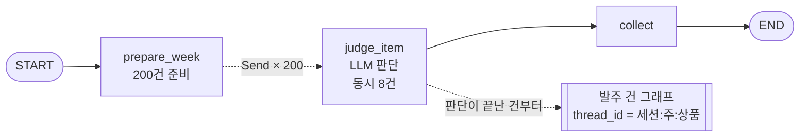
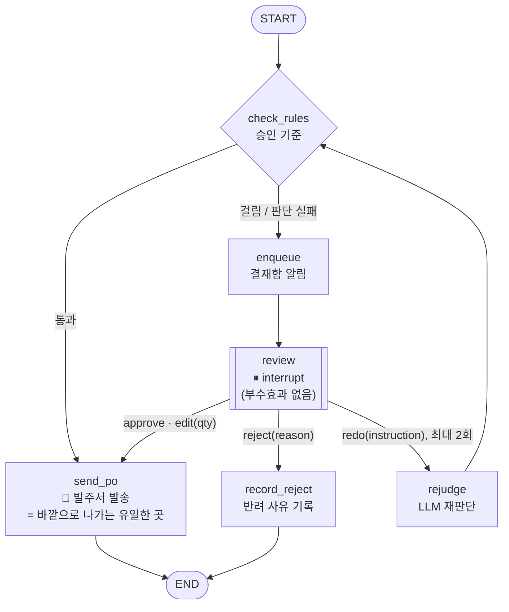
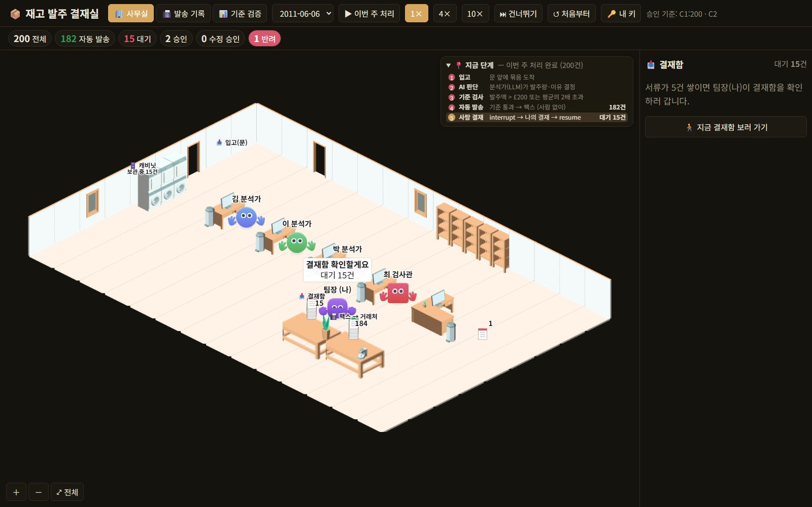
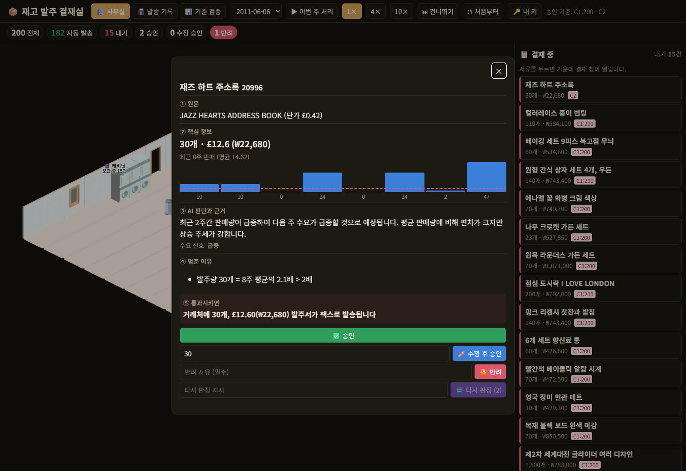

# REPORT — 사람이 승인하는 재고 발주 에이전트

모두의연구소 10강 「사람이 승인하는 에이전트 만들기 [프로젝트]」 · 실행 방법은 [README.md](README.md)

| 평가기준 | 이 저장소에서 |
|---|---|
| 1. 바꿀 수 없는 결정 전에 멈추고 사람의 답으로 이어서 실행 | 발주서 팩스 발송(`send_po`) 직전 `review` 에서 `interrupt` → `Command(resume)` (§2) |
| 2. 승인이 필요 없는 건은 자동 처리, 대기 건 보관 | 기준 통과 건은 곧바로 `send_po` · 대기 건은 SQLite/Postgres 체크포인터 — 재시작 후에도 유지 (§4.3) |
| 3. 승인 기준 설계와 이유 | 계산 가능한 기준 C1(발주액)·C2(평균 대비 배수) + 안전장치 F, 실행 전에 정한 규칙으로 실데이터에서 선택 (§3) |
| 4. 승인 과정을 확인할 수 있는 웹 데모 | 아이소메트릭 사무실 + 결재 패널·결재 창 + 발송 기록 + 기준 검증 (§5) |
| 5. 설계와 결과 정리 | 이 문서 |

---

## 1. 주제와 고른 이유

**재고 자동 발주.** LLM이 상품마다 최근 8주 판매를 보고 다음 주에 들여올 수량을 정하고, 거래처로 발주서를 보냅니다.

- **결과가 바깥으로 나가는 단계 = 발주서 발송(팩스).** 한 번 보내면 거래처가 물건을 준비하므로 되돌리기 어렵습니다. 그 전 단계(판매 기록 읽기, 수량 판단, 기준 검사)는 몇 번을 다시 해도 괜찮습니다. 그래서 **만드는 일(판단)과 보내는 일(발송)을 다른 노드로 나누고, 그 사이에서만 멈춥니다.**
- **실제 데이터로 "사람이 봤어야 했는지"를 채점할 수 있어서** 골랐습니다. [UCI Online Retail II](https://archive.ics.uci.edu/dataset/502/online+retail+ii)(영국 온라인 선물 도매점, 2009-12 ~ 2011-12, 106만 행)는 **실제 다음 주 판매량**이 있으므로, AI 발주가 얼마나 빗나갔는지(손해)를 사후에 셀 수 있습니다. 회의록·일정 같은 주제는 정답 라벨을 LLM이나 사람이 만들어야 해서, 기준 검증 숫자를 믿기 어렵다고 판단했습니다.
- 한 주에 발주 후보 **200건**(8주 중 6주 이상 팔린 상품에서 시드 42로 추출) — 교재의 "하루 200건"과 규모를 맞췄습니다.

## 2. 파이프라인 구조도

두 그래프로 나눴습니다. **발주 한 건 = thread_id 하나**라서 대기 건을 건마다 저장하고 이어갈 수 있습니다.

### 2.1 배치 그래프 — 이번 주 200건을 동시에 판단 (병렬화)

### 2.2 발주 건 그래프 — 한 건의 승인 절차 (라우팅 + HITL + 평가자-최적화 루프)

코드에서 직접 뽑은 그림: [docs/captures/graphs.md](docs/captures/graphs.md) (`uv run python -m scripts.graph_mermaid`)

### 2.3 워크플로 패턴 대응 (퀘스트 공지 — 모듈에서 배운 패턴 활용)

| 패턴 | 적용 위치 |
|---|---|
| 병렬화 (fan-out / fan-in) | `prepare_week` → `Send` × 200 → `judge_item` → `collect` |
| 라우팅 | `check_rules` 뒤(통과/멈춤), `review` 뒤(응답 네 가지) 조건부 분기 |
| 평가자-최적화 루프 | `redo` → `rejudge` → `check_rules` — 팀장 지시를 넣어 다시 판단, 최대 2회 |
| Human-in-the-Loop | `interrupt` + `Command(resume)` + 영속 체크포인터 |

### 2.4 State (`OrderState`)

| 키 | 내용 | 채워지는 곳 |
|---|---|---|
| `item` | 상품 코드·이름·단가·8주 판매·평균·변동계수 | 배치 그래프 |
| `judgment` | 발주량 · 한국어 이유 · 수요 신호(평소/증가/급증/감소) · 한국어 상품명 | `judge_item` / `rejudge` |
| `flags` | 걸린 기준과 사람이 읽을 문장(예: "발주액 £595 > 기준 £200") | `check_rules` |
| `decision` | 응답 종류 · 수정 수량 · 반려 사유 · 재판정 지시 | `review` (사람의 답) |
| `redo_count` · `po` · `status` | 재판정 횟수 · 발송 기록(자동/사람) · 상태 | 각 노드 |

**교재 2강의 "멈춘 단계 재실행" 함정** — resume 하면 `review` 가 처음부터 다시 돕니다. 그래서 `review` 안에는 `interrupt` 외에 아무것도 두지 않고, 결재함 알림은 바로 앞 `enqueue` 노드로 뺐습니다. `send_po` 는 thread_id 를 열쇠로 기록해 **같은 건이 두 번 나가지 않습니다(멱등)**. 둘 다 테스트로 확인합니다(`test_queued_event_emitted_once_across_resume`, `test_concurrent_double_approve`).

## 3. 승인 기준과 그 이유

### 3.1 채점 방법 — 실행 전에 정해 두었다

기준을 고르기 **전에**, 무엇을 "사람이 봤어야 할 건"으로 볼지와 어떻게 고를지를 스펙에 적고 커밋했습니다(`20fb513`). 결과를 보고 기준을 맞추지 않으려는 것입니다.

- **정답 라벨**: 손해액 = |AI 발주량 − 실제 다음 주 판매량| × 단가. **손해액 > £100 이면 "사람이 봤어야 할 건"**. (발주액 중앙값 약 £50 의 2배, 약 18만 원 — 담당자가 30초 보는 비용보다 확실히 큼)
- **세는 값**: 개입률(사람에게 온 비율) · **놓침**(봤어야 하는데 자동으로 나간 건 — 가장 비싼 실수, 손해 합계로도 셈) · **헛멈춤**(안 봐도 되는데 멈춘 건)
- **선택 규칙**: 개발 주(`2011-06-06`)에서 **개입률 25% 이하** 조합 중 **놓친 손해 합계가 가장 작은 것**, 동률이면 헛멈춤이 적은 것. 고른 기준을 **검증 주 2개**(`2011-09-05`, `2011-10-03`)에 그대로 적용해 보고하고, 검증 결과를 보고 다시 고르지 않는다.
- LLM은 확률적이므로 개발 주는 **3번 반복** 판단해 지표의 **흔들림 폭**도 보고한다.

### 3.2 기준 후보와 막으려는 위험 (모두 계산 가능한 형태)

| 기준 | 조건 | 막으려는 위험 |
|---|---|---|
| **C1 발주액** | 발주량 × 단가 > £X (100 / 200 / 300 비교) | 한 번에 큰돈이 나가는 발주 |
| **C2 평소 대비** | 발주량 > 최근 8주 평균의 2배 | LLM이 수요를 과장해 재고를 떠안는 경우 |
| C3 변동성 | 8주 판매 변동계수 > 1.2 | 원래 예측이 어려운 상품 |
| C4 LLM 신호 | 수요 신호가 급증·감소 | LLM 스스로 평소와 다르다고 본 경우 |
| C5 흔들림 | 3회 판단의 (최대−최소)/중앙값 > 30% | 같은 질문에 답이 흔들리는 불안정한 판단 |
| **F 안전장치** (항상) | LLM 호출 실패 · 형식 위반 · 발주량 > 평균의 10배 | "모르면 사람에게" — 판단이 없는데 자동으로 보내지 않는다 |

### 3.3 개발 주 비교표 (실제 gpt-4.1-mini 판단 · 200건 중 멈춰야 할 건 33건 · 판단 실패 0건)

괄호는 LLM을 3번 판단했을 때의 흔들림 폭(최소~최대).

| 기준 | 개입률 | 놓침 | 놓친 손해 | 헛멈춤 |
|---|---|---|---|---|
| 기준 없음 | 0.0% | 33건 | £6,676 | 0건 |
| C1(£100) | 25.5% (24.0~25.5%) | 11건 | £2,165 | 29건 |
| C1(£200) | 8.5% (8.0~9.0%) | 21건 | £3,672 | 5건 |
| C1(£300) | 5.0% | 27건 | £5,035 | 4건 |
| **C1(£200)+C2** ✅ | **9.0% (9.0~11.0%)** | **21건** | **£3,672 (£3,672~£4,235)** | **6건 (6~10)** |
| C1(£200)+C2+C3 | 28.5% | 17건 | £2,709 | 41건 |
| C1(£200)+C2+C4 | 31.5% | 14건 | £1,954 | 44건 |
| C1(£200)+C2+C4+C5 | 44.5% | 14건 | £1,954 | 70건 |
| 전부 멈춤 | 100% | 0건 | £0 | 167건 |

### 3.4 선택 — 그리고 사전 규칙을 한 번 보정한 경위

- **사전 등록 규칙만으로는 C1(£200) 하나가 뽑혔습니다.** C1(£100)은 놓친 손해가 가장 작지만 개입률 25.5%로 상한(25%)을 넘어 탈락했습니다.
- 그런데 과제 필수 요건은 **"계산 가능한 기준 두 가지 이상"** 입니다. 이 요건을 사전 규칙에 넣지 않은 것은 설계 실수였습니다.
- **결과를 본 뒤** 규칙에 "내용 기준이 2개 이상인 조합" 조건 하나만 더해 같은 규칙을 다시 적용했고, **C1(£200)+C2** 가 선택됐습니다. C1 단독과 놓친 손해(£3,672)가 같고 헛멈춤만 1건 늘어납니다. 라벨·상한·검증 주는 바꾸지 않았습니다. 이 보정은 스펙 §3.4 와 `runs/eval.json` 의 `preregistered`·`amendment` 에 그대로 남겨 두었습니다.

### 3.5 검증 주 — 고른 기준을 그대로 적용

| 주 | 멈춰야 할 건 | 개입률 | 놓침 | 놓친 손해 (기준 없으면) | 헛멈춤 |
|---|---|---|---|---|---|
| 2011-09-05 | 34건 | 12.5% | 22건 | £4,810 (£9,231) | 13건 |
| 2011-10-03 | 39건 | 19.0% | 18건 | £4,262 (£12,771) | 17건 |

**사람이 200건 중 12~19%만 보고도, 기준이 없을 때 새어 나가던 손해의 절반~3분의 1로 줄었습니다.**

### 3.6 자동으로 처리되는 건은 왜 사람이 안 봐도 되나 — 실제 예

기준에 걸리지 않은 건은 **발주액이 작고(£200 이하) 평소 판매량 근처**입니다. 틀려도 한 건의 손해가 작습니다.

| 상품 | 8주 평균 | AI 발주 | 실제 판매 | 손해 |
|---|---|---|---|---|
| 회전하는 잎 티라이트 홀더 (£1.66) | 8.8개 | 10개 | 0개 | £17 |
| 3개 세트 빨간 깅엄 로즈 보관 상자 (£3.75) | 47.6개 | 30개 | 26개 | £15 |
| 데이지 면화 유리병 (£2.95) | 12.5개 | 12개 | 15개 | £9 |

반대로 **멈춘 건이 실제로 위험했던 예**: 원목 라운더스 가든 세트 — AI 70개(£595, "발주액 £595 > 기준 £200"), 실제 판매 23개 → 멈추지 않았다면 손해 £400. 베이킹 세트 9피스 — AI 60개(£297), 실제 165개 → 손해 £520 (적게 산 쪽).

## 4. 실행 결과

### 4.1 주별로 멈춘 건 (선택 기준 C1(£200)+C2, 200건씩)

| 주 | 성격 | 자동 발송 | 결재함(멈춤) |
|---|---|---|---|
| 2011-06-06 | 개발 | 182건 | **18건 (9.0%)** |
| 2011-07-04 | 재생용 · 여름 | 178건 | 22건 (11.0%) |
| 2011-09-05 | 검증 | 175건 | 25건 (12.5%) |
| 2011-10-03 | 검증 | 162건 | 38건 (19.0%) |
| 2011-11-07 | 재생용 · 연말 성수기 | 152건 | **48건 (24.0%)** |

연말 성수기에는 큰 발주가 몰려 결재함이 평소의 2~3배로 쌓입니다. 판단 실패(F)는 다섯 주 모두 0건이었습니다.

### 4.2 LLM 이 단순 평균보다 나았나 (정직한 비교)

| 주 | LLM 발주 총손해 | 단순 8주 평균 발주 총손해 |
|---|---|---|
| 2011-06-06 (개발) | £10,912 | £12,232 |
| 2011-09-05 (검증) | £13,980 | £13,675 |
| 2011-10-03 (검증) | £17,487 | £17,357 |

**검증 주에서는 LLM이 단순 평균보다 조금 나빴습니다.** LLM 판단이 완벽하지 않다는 것이 이 과제의 출발점이고, 그래서 위험한 건을 사람이 보게 하는 구조가 필요합니다.

### 4.3 멈춤·재개·보관 확인

- **이어서 실행**: 결재함의 서류를 승인하면 멈춘 `review` 부터 이어져 `send_po` 까지 갑니다. 반려하면 `record_reject` 로 가고 팩스는 나가지 않습니다.
- **재시작 후 보관**: 2011-06-06 을 처리해 18건이 멈춘 상태에서 **서버를 껐다 켜도 같은 세션의 대기 18건이 그대로 남았고**, 그중 1건을 승인하자 이어서 발송됐습니다. 자동 테스트 `test_pending_survives_process_restart` 는 **다른 프로세스**에서 같은 SQLite 체크포인터를 열어 대기 건을 확인하고 승인합니다.
- **동시 결재**: 같은 건을 두 탭에서 동시에 승인해도 팩스는 1건, 늦은 쪽은 409.

### 4.4 사람(팀장)의 결재 기록

> 이 절은 팀장(사용자)이 웹 데모에서 직접 결재한 기록으로 채웁니다 — 에이전트가 사람을 대신해 결재한 기록을 넣지 않기 위해서입니다.

### 4.5 LLM 사용량

| 실행 | 호출 | 입력 토큰 | 출력 토큰 | 비용(gpt-4.1-mini) |
|---|---|---|---|---|
| 개발 주 3회 반복 | 600 | 214,974 | 41,658 | $0.153 |
| 검증 주 2개 | 400 | 143,304 | 27,816 | $0.102 |
| 재생용 주 2개 | 400 | 143,305 | 27,981 | $0.102 |
| **합계** | **1,400** | 501,583 | 97,455 | **약 $0.36** |

실행 도중 키가 무효(401)이거나 프로젝트 지출 한도에 걸린(429 `project_spend_limit_exceeded`) 적이 있었습니다(과금 없음). 이때 600건이 "판단 실패"로 캐시돼 다시 돌려도 건너뛰는 **결함을 발견해 고쳤습니다** — 이제 첫 호출에서 멈추고 아무것도 저장하지 않습니다.

## 5. 데모 화면 설계

### 5.1 사무실 — 에이전트의 다섯 단계를 몸으로 보여 준다

| 캐릭터 · 자리 | 에이전트에서 |
|---|---|
| 📥 입고(문) — 5건씩 들어온다 | 배치 그래프 입력 |
| 김·이·박 분석가 — 문에서 집어 와 판단하고 말풍선으로 말한 뒤 검사관에게 건넨다 | `judge_item` (LLM, 병렬) |
| 최 검사관 — 기준을 말하고 팩스 탁자 또는 결재함 탁자로 나른다 | `check_rules` → `send_po` / `enqueue` |
| 결재함 탁자 · 🗄️ 캐비닛 "보관 중 N건" | `interrupt` 로 멈춘 건 · 체크포인터 |
| 팀장(나) — 5건 쌓이면 확인하러 가고, 서류를 누르면 집어 와 결재 후 팩스/휴지통으로 | `Command(resume)` |

오른쪽 위 **📍 지금 단계** 설명란이 다섯 단계 중 무엇이 돌고 있는지, 누가 무엇을 하는지, 방금 일어난 일을 보여 줍니다.

### 5.2 결재 창 — 10초 안에 판단 (교재 4강)

**넣은 것 — 다섯 칸**: ① 원문(영문 상품명·단가) ② 핵심 정보(수량·금액 £/₩·**8주 판매 막대그래프와 평균선**) ③ AI 판단과 근거(이유 문장·수요 신호) ④ 멈춘 이유(걸린 기준을 **측정값 > 기준값**으로) ⑤ **통과시키면**: "거래처에 30개, £12.60(₩22,680) 발주서가 팩스로 발송됩니다".
**응답 네 가지**: 승인 · 수량 수정 후 승인(가장 흔한 경우) · 반려(사유 필수 — 나중에 기준을 고칠 재료) · 다시 판정(지시 입력, 최대 2회). 72시간 넘게 기다린 건은 "기한 초과 · 상위 결재자에게 넘김" 배지 — **자동 승인하지 않습니다**.

**뺀 것**
- **실제 다음 주 판매량(정답)** — 결재자도 미래를 모르는 상태여야 진짜 결재입니다. 정답은 기준 검증 탭에서만 씁니다.
- 원본 송장 목록·거래처 정보 — 10초 판단에 필요하지 않습니다.
- 상세 통계(표준편차 등) — 막대그래프와 평균선 한 줄로 대신했습니다.

### 5.3 그 밖의 화면

- **📠 발송 기록** — 거래처로 실제로 나간 발주서, 🤖 자동 / 👤 팀장 구분, 수정 전 AI 수량 표시 ([캡처](docs/captures/fax-about.png))
- **📊 기준 검증** — §3 의 비교표와 흔들림 폭, 선택 경위 ([캡처](docs/captures/eval-about.png))
- **🎞 녹화 재생 / 🟢 라이브** — 녹화된 실제 판단(비용 없음) 또는 내 키로 지금 새로 판단

## 6. 회고

### 가장 공들인 부분
- **기준을 결과에 맞추지 않기.** 라벨과 선택 규칙을 실행 전에 커밋하고, 개발 주에서 고른 기준을 검증 주에 그대로 적용했습니다. 과제 요건(기준 2개)을 빠뜨린 실수가 드러났을 때도 규칙을 몰래 바꾸지 않고 원래 결과와 보정 경위를 함께 남겼습니다.
- **HITL 의 함정을 테스트로 고정.** resume 때 멈춘 노드가 처음부터 다시 도는 문제(알림 두 번), 같은 건 이중 발송, 재시작 후 대기 건 유실을 각각 테스트로 막았습니다.
- **"모르면 사람에게".** LLM 실패·형식 위반·비상식적 수량은 기준과 상관없이 결재함으로 갑니다. 실제 실행에서 키·한도 문제로 600건이 실패로 캐시되는 결함을 만나 고쳤습니다.
- **사무실 장면이 에이전트의 실제 상태와 같은 숫자를 보이게** — 현황판·결재 패널·설명란이 모두 장면 기준으로 맞도록 여러 번 손봤습니다.

### 앞으로 보완할 점
- **놓친 건의 대부분은 "너무 적게 산" 경우였습니다.** 예: 아이스크림 디자인 가든 파라솔 — AI 10개, 실제 51개(손해 £326), 칠리 라이트 — AI 40개, 실제 95개(£272). 지금 기준(C1 발주액·C2 평균의 2배)은 **많이 사는 위험만** 봅니다. "평균의 절반 미만 발주" 같은 품절 쪽 기준을 후보에 넣어 다시 검증하고 싶습니다.
- **라벨의 비대칭.** 과잉 재고(보관비·폐기)와 품절(판매 기회 손실)은 비용이 다릅니다. 지금은 같은 무게로 셉니다.
- 결재선(담당자 → 팀장), 알림 채널(메신저), 반려 사유를 모아 기준을 자동으로 다시 제안하는 루프.
- 사무실 재연에서 캐릭터끼리 겹치는 시간을 4.4% → 1.2% 로 줄였지만, 목표로 잡은 1% 미만에는 못 미쳤습니다(좁은 통로에서 마주쳐 비켜설 자리가 없는 경우).
