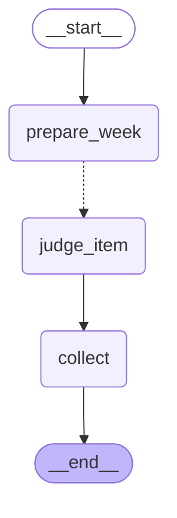
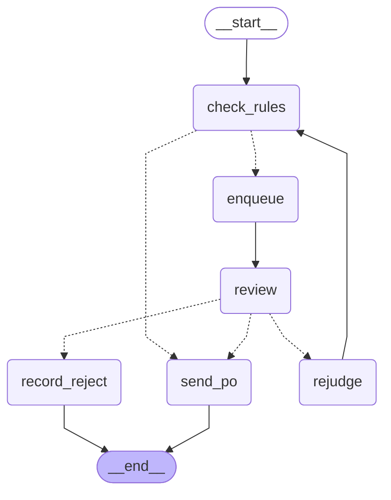

```mermaid
---
config:
  flowchart:
    curve: linear
---
graph TD;
	__start__([<p>__start__</p>]):::first
	prepare_week(prepare_week)
	judge_item(judge_item)
	collect(collect)
	__end__([<p>__end__</p>]):::last
	__start__ --> prepare_week;
	judge_item --> collect;
	prepare_week -.-> judge_item;
	collect --> __end__;
	classDef default fill:#f2f0ff,line-height:1.2
	classDef first fill-opacity:0
	classDef last fill:#bfb6fc
```

```mermaid
---
config:
  flowchart:
    curve: linear
---
graph TD;
	__start__([<p>__start__</p>]):::first
	check_rules(check_rules)
	enqueue(enqueue)
	review(review)
	send_po(send_po)
	record_reject(record_reject)
	rejudge(rejudge)
	__end__([<p>__end__</p>]):::last
	__start__ --> check_rules;
	check_rules -.-> enqueue;
	check_rules -.-> send_po;
	enqueue --> review;
	rejudge --> check_rules;
	review -.-> record_reject;
	review -.-> rejudge;
	review -.-> send_po;
	record_reject --> __end__;
	send_po --> __end__;
	classDef default fill:#f2f0ff,line-height:1.2
	classDef first fill-opacity:0
	classDef last fill:#bfb6fc
```
